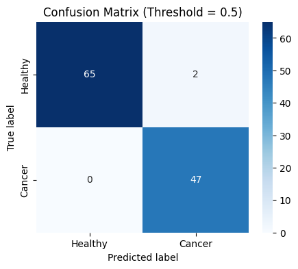
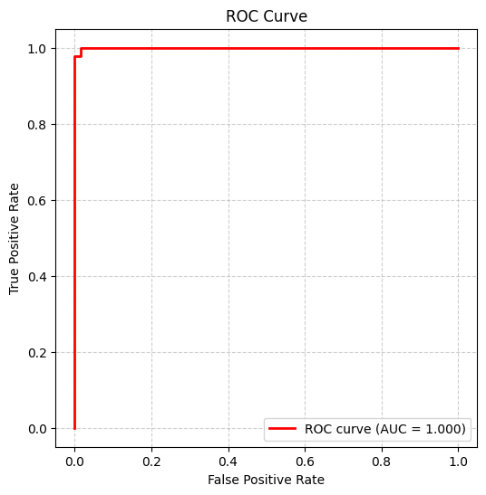

# Breast Cancer Prediction Web App

## Project Overview
This web application predicts whether a patient has breast cancer based on clinical and cytological measurements. Using machine learning (XGBoost), the app outputs the probability of cancer and provides key metrics to assess model performance.

## Performance

| Metric             | Value | Description                                |
|-------------------|-------|--------------------------------------------|
| Accuracy           | 0.97  | Overall correct predictions                |
| ROC-AUC            | 0.97  | Model’s ability to discriminate classes   |
| Recall / Sensitivity | 0.97 | Fraction of real cancer cases correctly identified |
| Specificity        | 0.96  | Fraction of healthy patients correctly identified |

### Confusion Matrix

### ROC Curve

## Features ✨
- Predict probability of breast cancer (0–1)
- Display model performance metrics:
  - **Accuracy** – Overall correctness
  - **ROC-AUC** – Model discrimination ability
  - **Recall / Sensitivity** – Detecting actual cancer cases
  - **Specificity** – Correctly identifying healthy patients
  - **Confusion Matrix** – Counts of TP, TN, FP, FN
- Future enhancement: Upload histopathology images to automatically extract features

## Dataset
- [**Wisconsin Breast Cancer Dataset (WBCD)**](https://github.com/basic-flow/Cancer-Prediction/blob/main/cancer.csv)
- **Samples:** 569
- **Features:** 30 numerical features per patient (e.g., `radius_mean`, `perimeter_mean`, `area_mean`, `smoothness_mean`, `concavity_mean`, `fractal_dimension_mean`)

## Model
- **XGBoost Classifier**
- **Performance:** Accuracy ≈ 0.97, ROC-AUC ≈ 0.97
- Trained on numerical features from WBCD

## License 📜

## Support

If you find this project useful and would like to support its development, you can:

⭐ **Star the Repository:** Show your appreciation by starring this project on GitHub.

💬 **Provide Feedback:** Open an issue or discussion to share your thoughts or suggestions.

🤍 **Donate via PayPal:** If you'd like to support me financially, you can donate via PayPal:

## Author

**Mohamed Moukbil**
